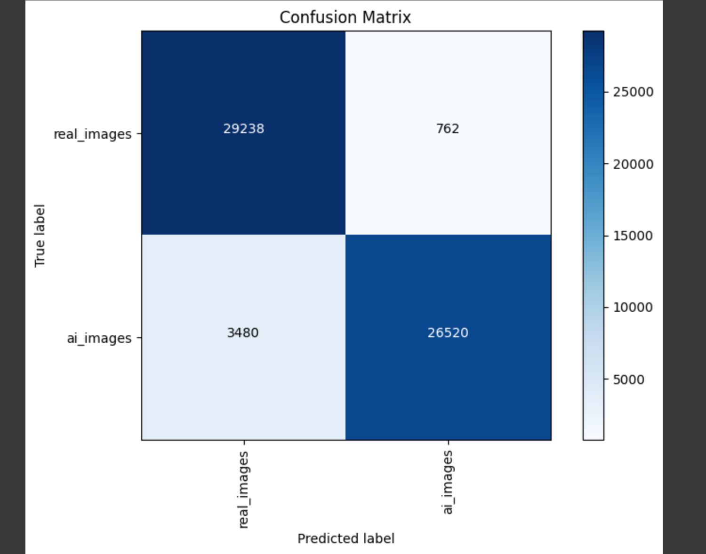

# IsThisReal.AI – AI-Generated Image Detection Browser Extension

This notebook trains a deep learning model to classify images as **AI-generated** or **real** using the **Vision Transformer (ViT)** architecture. It forms the backend engine for a browser extension that detects fake images on the web.

---

## 📌 Project Objective

To build a high-accuracy classifier that can distinguish between AI-generated images (from models like DALL·E, MidJourney, Stable Diffusion) and real-world photos, aiding in misinformation detection.

---

## 🧠 Model Architecture

- **Model Used:** Vision Transformer (ViT)
- **Library:** Hugging Face Transformers
- **Framework:** PyTorch
- **Task:** Binary classification (AI vs Real)

---

## 📁 Dataset Sources

1. [Sharma AI vs Real Images Dataset (V1)](https://www.kaggle.com/datasets/harsh7489/sharma-ai-real-images-dataset/data)  
2. [Sharma AI vs Real Images Dataset (V2)](https://www.kaggle.com/datasets/harsh7489/sharma-ai-real-images-dataset-v2/data)  
3. [140K Real and Fake Faces Dataset](https://www.kaggle.com/datasets/xhlulu/140k-real-and-fake-faces)

> Total images used: **500,000** (balanced 250k AI + 250k Real)

---
## 📈 Performance

- **Test Accuracy:** ~92.93%
- **Precision (AI Images):** 97.21%
- **Recall (Real Images):** 97.46%
- **F1-Score (Macro Average):** 92.92%

### 🧾 Confusion Matrix


### 📊 Classification Report


---

## 🎥 Demo Video

[](https://drive.google.com/file/d/15yEsrw0r3ITI3dvTBIkoP1-EzVGpctJn/view?usp=sharing)


---

## 🧪 Key Steps in the Notebook

- Data loading and preprocessing
  - Image resizing, normalization
  - Augmentation: flipping, cropping
- Dataset balancing
- Vision Transformer configuration using `ViTForImageClassification`
- Training and validation split (75/25)
- Evaluation using accuracy, loss plots, and confusion matrix

---

## 📈 Performance

- **Test Accuracy:** ~92.93%
- **Loss:** Tracked over training epochs
- **Confusion Matrix:** Visualized to analyze misclassifications

---

## ⚙️ Requirements

Install dependencies:
```bash
pip install torch torchvision transformers datasets matplotlib scikit-learn
